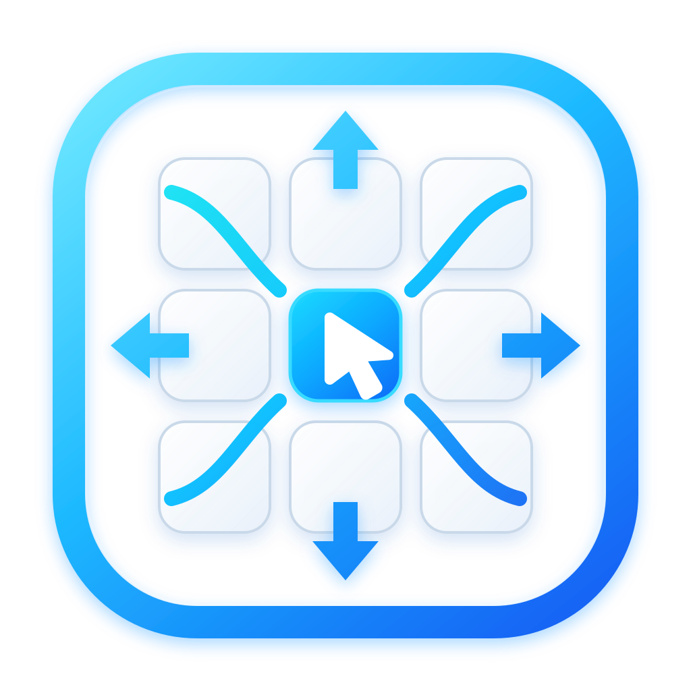

<div align="center">
  

# NumFlow

**Precise pointer control from your keyboard.**

A lightweight Windows-first accessibility utility for controlling the mouse pointer with the NumPad, built with Rust and Slint.
</div>

## Status

NumFlow v0.1 is in active development on `dev/master`.

The main application path is already wired end to end: global NumPad capture, background pointer runtime, time-based motion, mouse-button selection/click/drag behaviour, Slint settings UI, HUD feedback, profiles, custom bindings, persistent configuration, tray lifecycle, startup registration, single-instance protection, and fail-safe pointer release.

Num Lock is the global mode switch. NumFlow observes the physical Num Lock edge while running and
lets Windows own the actual toggle/LED: Num Lock On leaves the NumPad available for normal numeric
input, while Num Lock Off activates NumFlow pointer control. The mode changes immediately in the
background without restarting the application. A short asynchronous cue distinguishes NumFlow On
from NumFlow Off.

Recent reliability work also removed high-frequency idle polling from the background runtime. The worker now sleeps until input or a command arrives while motion is idle, and the Slint bridge uses event-driven wakeups instead of a fixed UI polling timer.

> **Branch policy:** all v0.1 development happens only in `dev/master`. `master` must remain untouched until a release/merge is explicitly approved.

## Current capabilities

- Global Windows NumPad input through `WH_KEYBOARD_LL`.
- Physical Num Lock observation as the NumFlow mode switch.
- Num Lock On → normal NumPad numeric input; Num Lock Off → NumFlow pointer control.
- Tagged `SendInput` replay is used only for explicit UI requests and deferred lifecycle repair.
- Separate non-blocking audio cues for NumFlow On and NumFlow Off.
- Pointer movement and mouse-button injection through `SendInput`.
- Smooth time-based movement with acceleration and diagonal normalization.
- Configurable speed, acceleration, precision mode, and per-profile bindings.
- Left, right, and middle mouse-button selection.
- Single click, double click, hold/drag lock, and release.
- Compact material-styled Slint settings window with a separate editable Bindings panel.
- Status icons for NumFlow state, selected mouse button, and precision mode.
- Built-in `Normal`, `Precision`, and `Fast` profiles.
- Editable NumPad bindings that apply at runtime.
- HUD feedback and persistent drag-state feedback.
- Persistent TOML configuration with schema validation and atomic writes.
- Safe fallback to defaults when configuration is invalid/corrupted.
- Start-minimized and start-with-Windows configuration.
- Single-instance protection.
- Fail-safe release of a held mouse button during disable/shutdown/error paths.
- Event-driven UI runtime notifications.
- Idle background runtime that blocks instead of waking on every motion tick.

## Default controls

| Key | Action |
| --- | --- |
| `Num Lock` | Toggle NumFlow mode: On = digits, Off = pointer control |
| `8` | Move up |
| `2` | Move down |
| `4` | Move left |
| `6` | Move right |
| `7` | Move up-left |
| `9` | Move up-right |
| `1` | Move down-left |
| `3` | Move down-right |
| `5` | Click selected mouse button |
| `+` | Double click selected mouse button |
| `0` | Hold selected mouse button / start drag lock |
| `.` | Release held mouse button |
| `/` | Select left mouse button |
| `*` | Select right mouse button |
| `-` | Select middle mouse button |

Num Lock itself is reserved by NumFlow while the app is running. Other NumPad bindings are configurable; the core logic does not depend on fixed virtual-key codes.

## Installation

Windows x64 releases provide two artifacts:

- **MSI:** `NumFlow-<version>-x64.msi` installs to `C:\Program Files\NumFlow`, creates a Start Menu shortcut, and appears in Windows Installed Apps.
- **Portable:** `NumFlow-<version>-portable-x64.zip` can be extracted and run without installation.

`Start with Windows` remains an explicit user preference. When enabled, NumFlow registers the current executable under the current-user Windows Run key with `--background`, so the global input runtime and tray start after sign-in without opening the settings window. The startup registration itself does not require administrator rights.

See [`docs/INSTALLATION.md`](docs/INSTALLATION.md) for installation, portable usage, autostart, uninstall, signing status, and checksum details.

## Running from source

### Requirements

- Windows development environment.
- Rust `1.98`.
- Cargo with the committed `Cargo.lock`.

Clone the repository, switch to the development branch, and run:

```powershell
git switch dev/master
cargo run --locked
```

Useful quality commands:

```powershell
cargo fmt --all -- --check
cargo clippy --locked --workspace --all-targets --all-features -- -D warnings
cargo test --locked --workspace --all-features
cargo build --locked --workspace --release --all-features
```

See [`docs/DEVELOPMENT.md`](docs/DEVELOPMENT.md) for the development and architecture notes.

## Configuration

On Windows, NumFlow stores its user configuration at:

```text
%APPDATA%\NumFlow\config.toml
```

The configuration is versioned (`schema_version = 1`) and currently contains:

- active profile;
- HUD state;
- start-minimized state;
- start-with-Windows state;
- interface-sound enable state and 0–100% volume;
- profile speed / maximum speed / acceleration;
- precision and boost multipliers;
- selected mouse button;
- custom NumPad bindings.

Writes are atomic. Invalid or unsupported configuration is recovered to safe defaults rather than being applied partially.

Interface sounds can be enabled or disabled in Advanced settings, and their 0–100% volume is persisted independently from the Windows system mixer.

## Architecture

```text
NumFlow application
├── Slint UI / tray / HUD
├── Application layer
│   ├── config lifecycle
│   ├── UI ↔ runtime bridge
│   └── background runtime orchestration
├── numflow-core
│   ├── bindings
│   ├── state machine
│   ├── motion engine
│   └── pointer effects
└── numflow-windows
    ├── WH_KEYBOARD_LL hook
    ├── Num Lock interception/replay
    ├── key normalization
    ├── asynchronous audio feedback
    ├── SendInput pointer backend
    ├── HUD placement helpers
    ├── single-instance guard
    └── Windows startup registration
```

`numflow-core` remains platform-independent. Win32-specific code stays in `numflow-windows`, and the UI does not call Win32 APIs directly.

## Runtime and safety

NumFlow treats input interception and drag state as safety-critical:

- the keyboard hook callback does not perform blocking application work;
- the physical keyboard queue is bounded and uses non-blocking delivery from the hook callback;
- physical Num Lock presses are observed by NumFlow and passed through to Windows, so Windows owns
  the actual toggle state and LED;
- NumFlow uses a tagged synthetic Num Lock press only for explicit mode requests or deferred
  lifecycle repair;
- NumFlow ignores its own replay in the hook, preventing recursive/double mode changes;
- physical Num Lock never depends on a deferred replay, so UIPI or a transitioning input desktop
  cannot leave the OS toggle and NumFlow mode split;
- audio playback runs on a separate bounded worker and never blocks the keyboard hook;
- the runtime command queue is bounded;
- interception starts disabled until the application runtime is ready;
- pointer motion ticks run only while motion is active;
- while idle, the worker blocks on real input/commands instead of a high-frequency sleep loop;
- UI wakeups are event-driven;
- disable/shutdown paths stop movement and release any held mouse button.

The `RuntimeEvent → UI` bridge uses bounded, non-blocking delivery so a stalled UI cannot create an unbounded producer queue. Manual soak and fault/backpressure validation remains part of the release checklist.

## CI

GitHub Actions runs the Windows quality gate on `dev/master` using Rust `1.98`:

1. `cargo fmt --all -- --check`
2. `cargo clippy --locked --workspace --all-targets --all-features -- -D warnings`
3. `cargo test --locked --workspace --all-features`
4. `cargo build --locked --workspace --release --all-features`

The current Windows quality gate runs 98 deterministic tests (43 application, 37 Windows backend, 12 portable core black-box, and 6 Windows keyboard black-box) plus 1 explicitly ignored interactive hook smoke test. Real Sleep/Unlock, device reconnect, focus, and integrity scenarios remain manual release checks; see [`docs/TESTING.md`](docs/TESTING.md).

## v0.1 work still open

The remaining work is primarily validation and release readiness rather than major product functionality:

- long-running resource/soak validation;
- manual Windows 10/11 validation;
- DPI scaling validation from 100% through 200%;
- Num Lock interception/replay, LED synchronization, audio, and rapid-toggle validation on real hardware;
- foreground/background application validation;
- multi-monitor and sleep/resume validation;
- final accessibility and keyboard-navigation pass;
- final executable metadata and production code-signing policy;
- clean-machine MSI/portable validation and remaining manual release evidence.

See [`docs/INSTALLATION.md`](docs/INSTALLATION.md), [`docs/RELEASING.md`](docs/RELEASING.md), [`docs/RELEASE_CHECKLIST.md`](docs/RELEASE_CHECKLIST.md), [`CHANGELOG.md`](CHANGELOG.md), and the [v0.1 roadmap](https://github.com/GendByteMaster/NumFlow/issues/1).

## Windows input limitation

NumFlow uses the Win32 `SendInput` API for simulated pointer movement, mouse-button events, and the tagged Num Lock replay used to keep the Windows toggle state synchronized. Windows User Interface Privilege Isolation (UIPI) permits input injection only into applications running at an equal or lower integrity level. A normally launched NumFlow process therefore might not control an elevated/admin application.

`SendInput` does not reliably report that UIPI was the specific reason an injection was blocked, so this limitation must not be treated as a random pointer-backend failure. NumFlow should run without elevation by default; elevation is not a general workaround and is outside the v0.1 default design.

Task Manager is commonly elevated. NumFlow logs the foreground executable, target integrity/elevation, hook callback count, and the failed injection so this case is distinguishable from a dead `WH_KEYBOARD_LL` listener. Reinstalling the hook cannot cross UIPI. Run `numflow.exe --elevated` to start the explicit UAC-approved profile when elevated-window control is required. The ordinary tray/background profile remains non-elevated. A no-prompt production accessibility profile instead requires a properly signed, securely installed `uiAccess` build.

Close an already running non-elevated NumFlow instance before starting `--elevated`; singleton ownership intentionally prevents medium- and high-integrity hooks from running together.

## Platform direction

NumFlow v0.1 is Windows-first, and Windows is the only supported release platform today. **Linux and macOS support is planned for future versions.** The core is intentionally kept platform-independent so future platform backends can reuse the state machine, bindings, motion engine, and application architecture instead of duplicating the product logic.

The backend contract and current Windows/Linux/macOS boundaries are documented in [`docs/PLATFORM_BACKENDS.md`](docs/PLATFORM_BACKENDS.md). Linux and macOS currently fail explicitly because their permission-aware global capture implementations are not complete; they are not represented by the Windows hook or a silent no-op.

## License

MIT. See [`LICENSE`](LICENSE).
